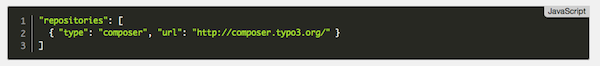

.. ==================================================
.. FOR YOUR INFORMATION
.. --------------------------------------------------
.. -*- coding: utf-8 -*- with BOM.

.. _introduction:

Introduction
============

.. only:: html

This chapter gives you a basic introduction about the TYPO3 CMS extension "*fs_code_snippet*".

.. _introduction-what:

What does it do?
================
This extension implements a content element that enables you to render code snippets of various
programming languages. It depends on fluid_styled_content rendering.

It makes use of the T3Editor in the backend and the code snippet library prism.js in the frontend.

.. _screenshots:

Screenshots
-----------

